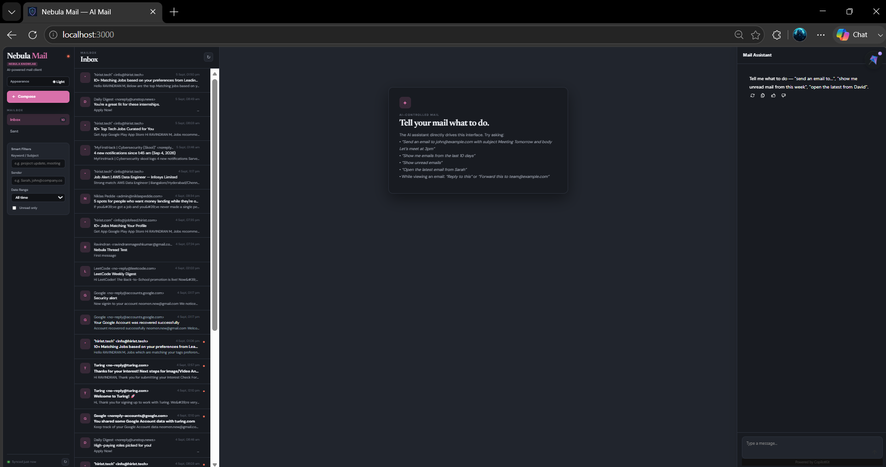
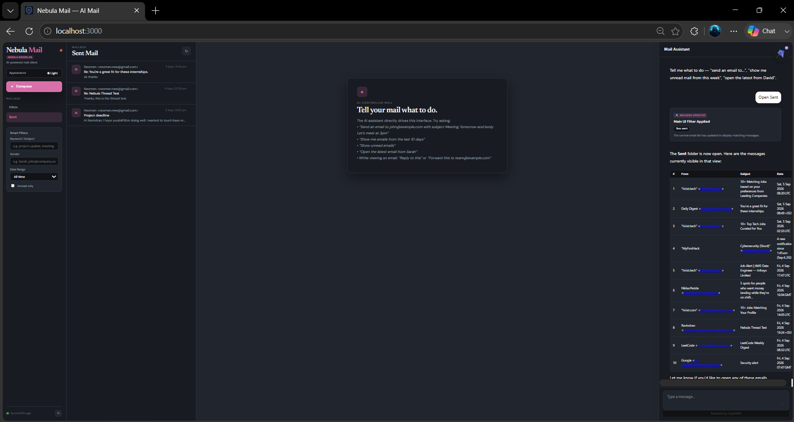
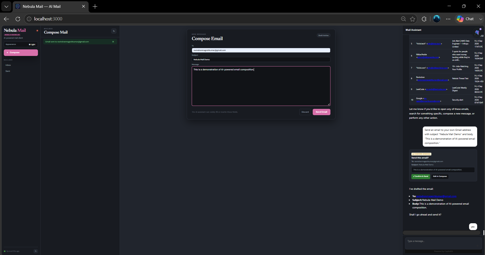
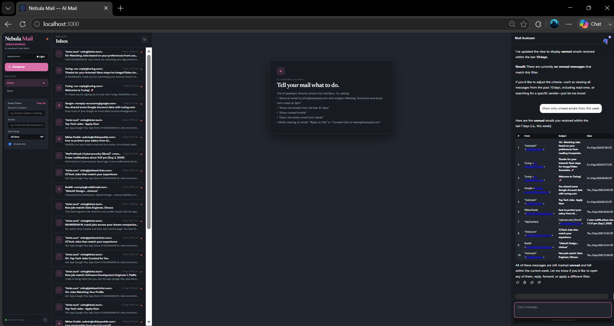
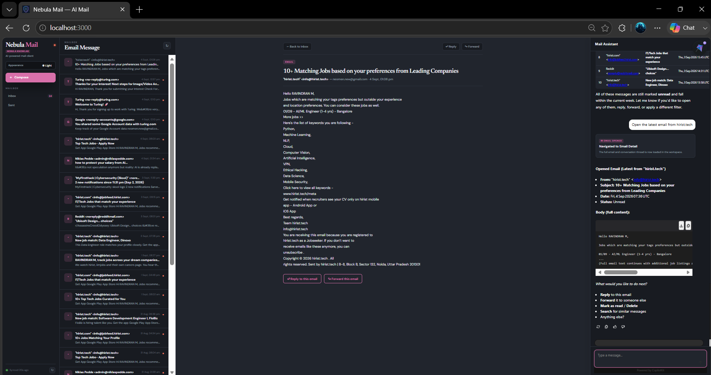
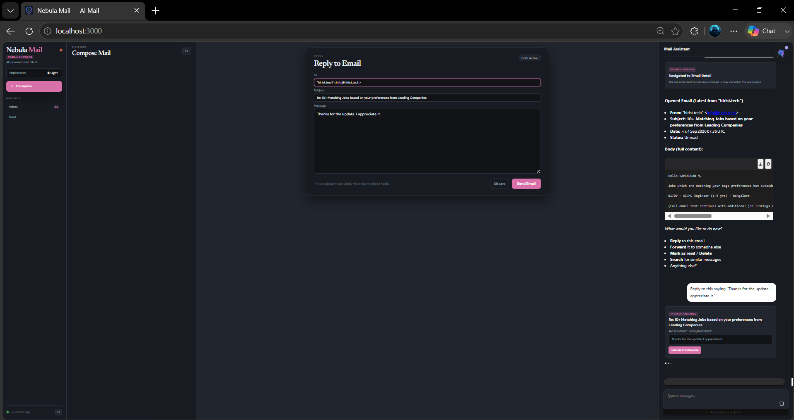
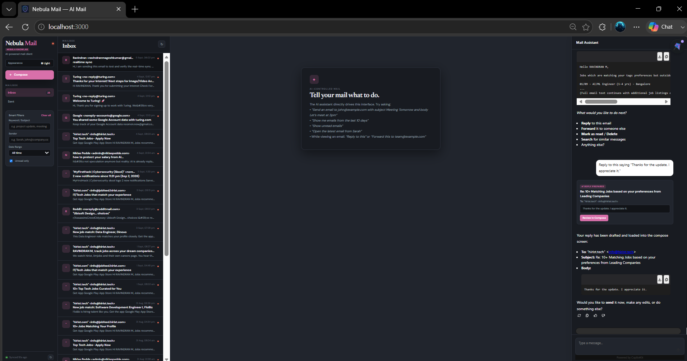
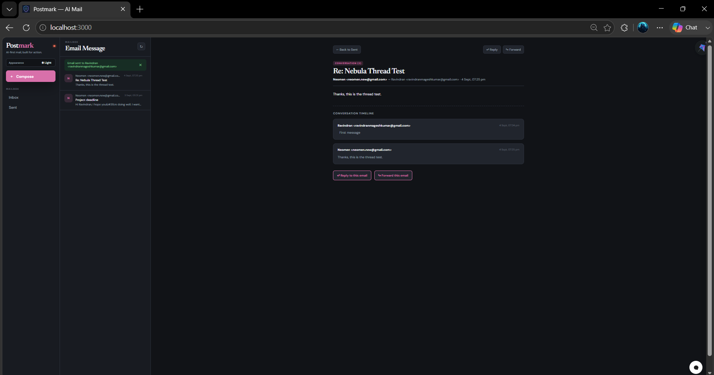
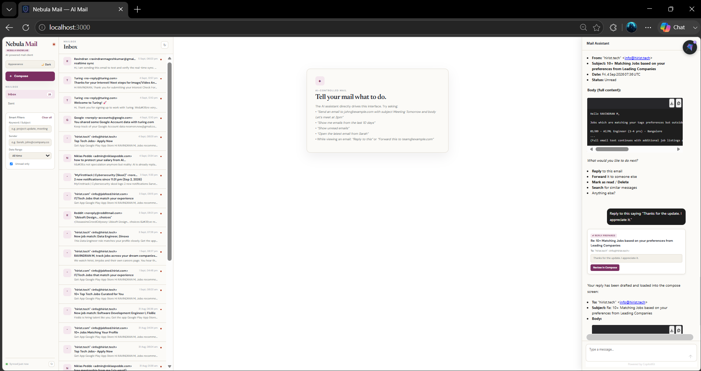
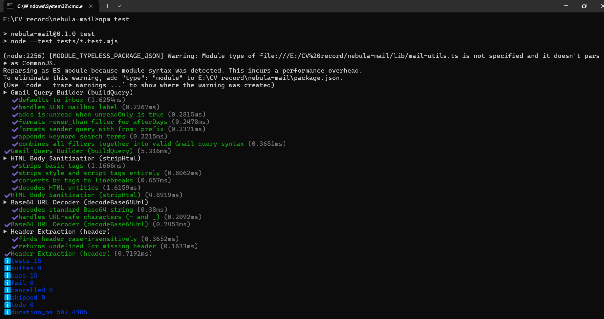

# Nebula Mail — AI-Powered Mail Web Application

A hiring-task implementation for **Nebula KnowLab**.

Nebula Mail is a real Gmail-powered mail client with an integrated AI assistant that **controls the application UI through natural language** instead of behaving as a text-only chatbot.

The assistant can compose emails, navigate between views, search and filter the mailbox, open messages, and prepare context-aware replies.

---

## Overview

Nebula Mail combines:

- Real Gmail integration through Google OAuth 2.0
- Inbox and Sent views using real Gmail data
- Email detail and conversation views
- Compose, reply, forward, and send workflows
- Natural-language AI control of the interface
- AI-powered mailbox search and filtering
- Context-aware reply drafting
- Background mailbox synchronization
- Human confirmation before sending
- Rich AI interaction cards
- Light and dark themes
- Automated tests

### Core Design Principle

> The AI operates on the same application UI and state used by a human user.

The assistant does not maintain a separate or simulated mailbox. AI actions interact with the application's existing UI state and workflows.

---

## Features

### Gmail Integration

- Google OAuth 2.0 authentication
- Gmail API integration
- Real Inbox data
- Real Sent data
- Email detail view
- Email sending through Gmail
- Local OAuth token persistence for the hiring-task environment

### AI UI Control

The assistant controls the actual application interface through natural language.

Example commands:

```text
Send an email to john@example.com with subject "Meeting Tomorrow"
and body "Let's meet at 3pm"
```

```text
Show only unread emails from this week
```

```text
Open the latest email from hirist.tech
```

```text
Reply to this saying "Thanks for the update."
```

The assistant updates the actual application UI rather than returning only a text response.

### Mailbox Features

- Inbox
- Sent
- Email detail
- Compose
- Reply
- Forward
- Thread / conversation view
- Unread filtering
- Sender filtering
- Keyword filtering
- Date filtering

### Real-Time Mail Synchronization

The application performs background Gmail synchronization every 15 seconds.

New messages appear in the Inbox automatically without requiring a manual browser refresh.

### Human-in-the-Loop Sending

The assistant prepares and fills the email form while the user remains in control of the final send action.

The user can:

- Review the generated email
- Edit the email
- Confirm sending
- Cancel the action

### Rich AI UI

The assistant provides structured UI cards for:

- Drafts
- Confirmation
- Filters
- Opened emails
- Prepared replies

### Themes

- Light mode
- Dark mode
- Responsive interface

---

## Technology Stack

- **Framework:** Next.js 14 (App Router)
- **Frontend:** React 18, TypeScript
- **AI / LLM Integration:** CopilotKit + Groq
- **Email Service:** Gmail API + Google OAuth 2.0
- **Testing:** Node.js native test runner (`node:test`)
- **Styling:** CSS variables with Light / Dark theme support

---

## Architecture

```text
Browser
│
├── MailApp
│   ├── Inbox
│   ├── Sent
│   ├── Email Detail
│   └── Compose / Reply / Forward
│
├── AssistantActions
│   └── CopilotKit actions that control the actual UI state
│
├── /api/gmail/messages
│   └── lib/gmail.ts
│       └── Gmail API
│
├── /api/gmail/send
│   └── lib/gmail.ts
│       └── Gmail API
│
└── /api/copilotkit
    └── Groq LLM
        └── Frontend actions
```

### Key Design Principle

The assistant does not maintain a separate or simulated mailbox.

For example:

```text
"show unread emails from this week"
        ↓
AI action
        ↓
Mailbox filter state
        ↓
Actual Inbox UI updates
```

And:

```text
"send an email to ..."
        ↓
AI action
        ↓
Compose UI
        ↓
To / Subject / Body fields are populated
        ↓
User reviews and sends
```

This makes the assistant a UI co-pilot rather than a separate text-only chatbot.

---

## Design Trade-offs

### Polling Instead of Provider Push

The application polls Gmail every 15 seconds instead of using a separately managed push infrastructure.

This keeps the hiring-task implementation simple to run locally while still allowing new email to appear without a manual refresh.

A production implementation could replace the polling trigger with Gmail push notifications and Google Cloud Pub/Sub.

### Local OAuth Token Storage

The current implementation stores OAuth credentials in `.gmail-token.json` for the single-user hiring-task environment.

A production multi-user service would persist encrypted OAuth credentials securely per user in a database or managed credential store.

### Human Confirmation Before Sending

The assistant prepares the email but does not silently send it.

The user explicitly reviews the generated message and confirms the final send action.

This keeps external side effects visible and user-controlled.

---

## Gmail OAuth Setup

Nebula Mail uses Google OAuth 2.0 to connect to Gmail.

### 1. Create a Google Cloud Project

Create a Google Cloud project and enable the **Gmail API**.

### 2. Create OAuth Credentials

Create an **OAuth Client ID** for a Web application.

Configure the authorized redirect URI:

```text
http://localhost:3000/api/gmail/callback
```

### 3. Configure Environment Variables

Create `.env.local` using `.env.example` as a template:

```env
GOOGLE_CLIENT_ID=
GOOGLE_CLIENT_SECRET=
GOOGLE_REDIRECT_URI=http://localhost:3000/api/gmail/callback
GROQ_API_KEY=
TOKEN_STORE_PATH=.gmail-token.json
```

### 4. Authorize Gmail

Start the application:

```bash
npm run dev
```

Open:

```text
http://localhost:3000
```

Then visit:

```text
http://localhost:3000/api/gmail/auth
```

Complete the Google authorization flow.

Each evaluator should authorize the Google account they intend to use for testing.

For an OAuth application in Testing mode, the Google account used for evaluation must be configured as an allowed test user in the Google OAuth settings.

No Gmail access token is included in this repository.

---

## Run Locally

### Prerequisites

- Node.js 22+
- npm
- Google Cloud project
- Gmail API enabled
- Google OAuth credentials
- Groq API key

### 1. Install Dependencies

```bash
npm install
```

### 2. Configure Environment

Create:

```text
.env.local
```

using:

```text
.env.example
```

as the template, then add your local credentials.

### 3. Start the Development Server

```bash
npm run dev
```

Open:

```text
http://localhost:3000
```

---

## AI Interaction Examples

### 1. Compose an Email

Prompt:

> "Send an email to john@example.com with subject 'Meeting Tomorrow' and body 'Let's meet at 3pm'."

Expected behavior:

1. Compose view opens.
2. Recipient is populated.
3. Subject is populated.
4. Body is populated.
5. User can review the generated content.
6. User can confirm or edit before sending.

### 2. Search and Filter

Prompt:

> "Show only unread emails from this week."

Expected behavior:

- Inbox filters are updated.
- The main mailbox list changes.
- Matching messages are displayed.

### 3. Open an Email

Prompt:

> "Open the latest email from hirist.tech."

Expected behavior:

- The matching email is identified.
- The application navigates to the email detail view.
- The selected email and conversation timeline are displayed.

### 4. Context-Aware Reply

While viewing an email:

> "Reply to this saying 'Thanks for the update.'"

Expected behavior:

- The current open email is used as context.
- The original sender is selected automatically.
- The subject becomes `Re: <Original Subject>`.
- The reply body is populated in the compose UI.

---

## Screenshots

### 1. Inbox — Real Gmail Data



### 2. Sent Mail — AI Navigation



### 3. AI Compose — Filled Form and Confirmation



### 4. AI Search and Filter



### 5. AI Open Email



### 6. Context-Aware Reply



### 7. Real-Time Mail Sync



### 8. Thread / Conversation View



### 9. Light Mode / Polished UI



### 10. Automated Tests



---

## Testing

The project includes automated unit tests for core mail utility behavior.

Run:

```bash
npm test
```

Verified result:

```text
tests 15
suites 4
pass 15
fail 0
```

The test suite covers:

- Gmail query construction
- Inbox and Sent query handling
- Unread filtering
- Date filtering
- Sender filtering
- Keyword filtering
- HTML body sanitization
- URL-safe Base64 decoding
- Case-insensitive email header extraction

---
